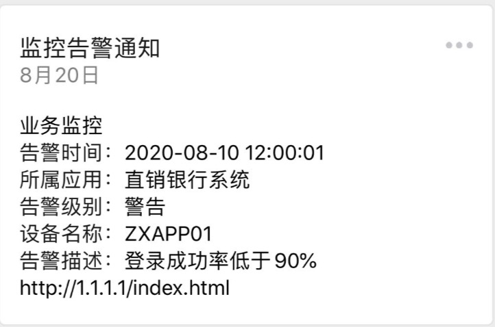

# WeiXinTemplateMsg
项目说明  

        本项目旨在更容易使用微信订阅号、服务号的模板消息功能。

效果展示

        

使用方法  

1.设置Config

        //创建config，并设置
        Config config=Config.getInstance();
        config.setAppid("wxaa520c9978d0b71c");//设置appid
        config.setSecret("63820aef1817ce9f32dd60e9dc0966dc");//设置secret
        config.setTemplateId("V10O3GiHObMYYc2ZwaJxkKhVBxBJV3WzGdwtNof6DgE");//设置模板id
        
        //设置模板内容
        config.setTemplate("{{first.DATA}}\n" +
                "告警时间：{{keyword1.DATA}}\n" +
                "所属应用：{{keyword2.DATA}}\n" +
                "告警级别：{{keyword3.DATA}}\n" +
                "设备名称：{{keyword4.DATA}}\n" +
                "告警描述：{{keyword5.DATA}}\n" +
                "{{remark.DATA}}");
       
2.创建TemplateMsgSender对象,调用send方法发送消息.消息的内容须要与模板内容一一对应
        
        
        TemplateMsgSender msgSender=new TemplateMsgSender(config);
        String alarm="{{业务监控}}\n" +
                "告警时间：{{2020-08-10 12:00:01}}\n" +
                "所属应用：{{直销银行系统}}\n" +
                "告警级别：{{警告}}\n" +
                "设备名称：{{ZXAPP01}}\n" +
                "告警描述：{{登录成功率低于90%}}\n" +
                "{{http://1.1.1.1/index.html}}";
        msgSender.send(alarm);
